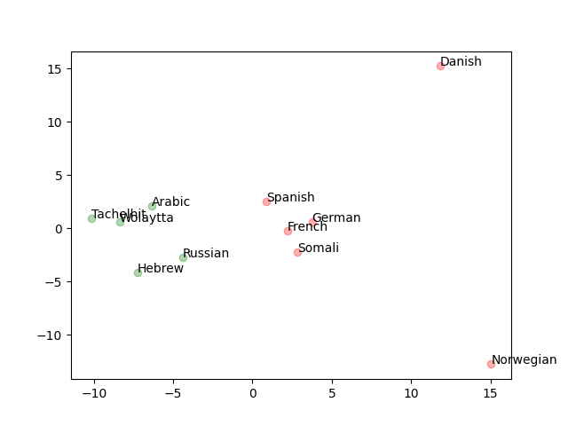
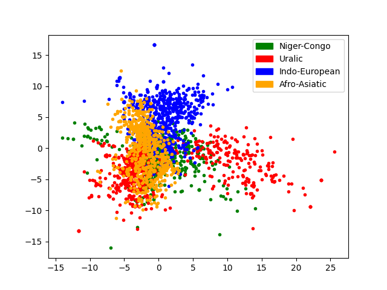

# Rediscovering Language Family Taxonomies using Distributional Semantics
This project tries to see if static word embedding models trained on parallel Bible translations, using word2vec, is enough to cluster languages according to traditional language families. Models are trained on the same sections of the Bible (approximately 30k segmented lines), with the same hyperparameters, for a relatively short period of time. 

  
   
  <em>A first attempt at seperating some Indo-European and Afro-Asiatic languages (with some errors).</em>

 

  
   
  <em>PCA plot of 100 observations for three languages in each of the families: Niger-Congo, Uralic, Indo-European, Afro-Asiatic.</em>

## Things to look at 

- How does the embedding size influence the clustering.
- Differences between tSNE and PCA for dim.reduction on this type of data.
- The impact of components during the dim.reduction.
- Differences between clustering algorithms.
- Latin/Non-Latin scripted languages.
- Other types of genus and sub-genus.
- Why is the Danish translation so off?
- What type of conclusions can be drawn from thesd groupings?
- Other types of pooling.
- Cluster on something other than the averaged Bible vector per langauge.

## Data
I'm using the translations made available through the paper *A massively parallel corpus: the Bible in 100 languages*, by Christos Christodoulopoulos and Mark Steedman. The paper can be read [here](https://link.springer.com/article/10.1007/s10579-014-9287-y), and the data is available through the [NLPL](https://opus.nlpl.eu/bible-uedin.php). To run the scripts, download the languages you would like to work with through that url and place the extracted folder in the project root. For the languages that have been translated using MT, remove the *-MT* suffix on the XML.

## Method

As of now:
- Parse source XML to JSON and serialize into a line-by-line corpus.
- Train a word2vec model either with skipgram or CBOW.
- Create averaged vectors of a sample of lines from the Bible per language (averaged over words).
- Cluster using KMeans.
- Do PCA on the clustered embeddings.
- Plot the PCA results, coloured by the original gold label (the actual language family)
- Metric of success: Do the colours cluster together? If so, something interesting might be happening.  

